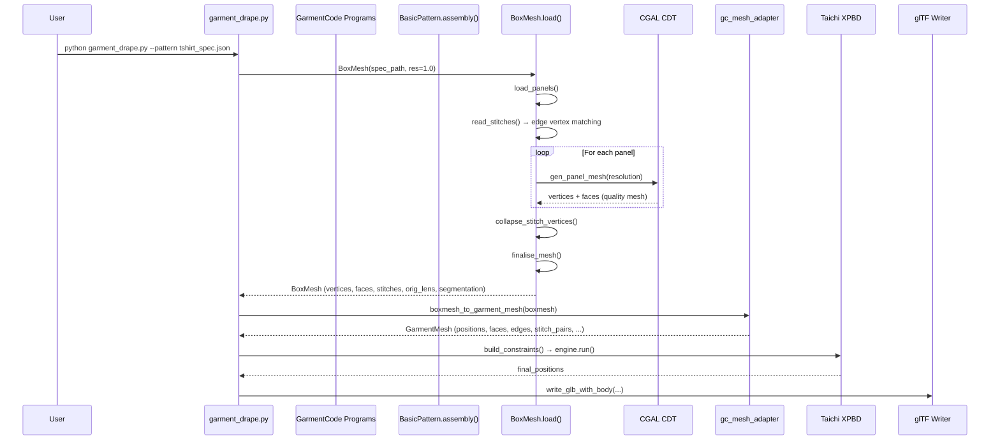
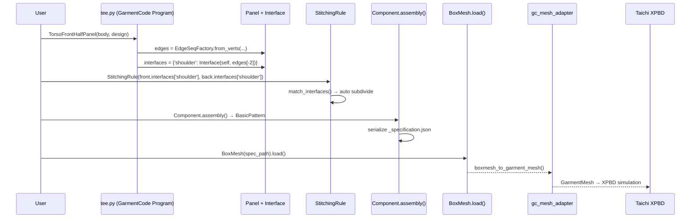

# Strategy C: Adopt GarmentCode's Pattern & Mesh Architecture

## Goal

Replace garment-sim's ad-hoc pattern representation and `earcut`-based triangulation with GarmentCode's **battle-tested pattern pipeline**: parametric edge types (Bézier, arc), `Panel → Interface → StitchingRule` hierarchy, CGAL-quality constrained Delaunay triangulation, and automatic stitch vertex collapse. Keep our **Taichi XPBD engine** (GPU-portable, no NVIDIA lock-in) for simulation.

The end state: GarmentCode pattern programs → GarmentCode mesher → garment-sim XPBD solver → glTF export.

---

## Current Architecture vs. Target Architecture

```mermaid
graph TD
    subgraph "CURRENT garment-sim"
        A1["Pattern JSON<br/>(manual vertices_2d + edges)"]
        A2["triangulation.py<br/>(earcut + Steiner points)"]
        A3["panel_builder.py<br/>(placement + stitch resolution)"]
        A4["XPBDSolver<br/>(Taichi)"]
        A5["BodyCollider / Export"]
        A1 --> A2 --> A3 --> A4 --> A5
    end

    subgraph "TARGET merged pipeline"
        B0["GarmentCode Pattern Programs<br/>(tee.py, bodice.py, sleeves.py, pants.py)"]
        B1["pygarment.garmentcode<br/>(Panel, Edge, Interface, StitchingRule)"]
        B2["pygarment.meshgen.boxmeshgen<br/>(CGAL CDT + mesh refinement)"]
        B3["gc_mesh_adapter.py ★<br/>(BoxMesh → GarmentMesh)"]
        B4["XPBDSolver<br/>(Taichi, unchanged)"]
        B5["BodyCollider / Export<br/>(unchanged)"]
        B0 --> B1 --> B2 --> B3 --> B4 --> B5
    end

    style B0 fill:#c8e6c9,stroke:#333
    style B1 fill:#c8e6c9,stroke:#333
    style B2 fill:#c8e6c9,stroke:#333
    style B3 fill:#fff9c4,stroke:#333
    style B4 fill:#bbdefb,stroke:#333
    style B5 fill:#bbdefb,stroke:#333
```



> [!IMPORTANT]
> **★ `gc_mesh_adapter.py`** is the new glue module we write. Everything in green comes from GarmentCode (vendored or pip-installed). Everything in blue stays unchanged from garment-sim.

---

## Architecture Changes Required

### 1. New Module: `gc_mesh_adapter.py`

This is the **bridge** between GarmentCode's `BoxMesh` output and garment-sim's `GarmentMesh` dataclass.

**Location:** `backend/simulation/mesh/gc_mesh_adapter.py`

**Responsibilities:**
```python
def boxmesh_to_garment_mesh(boxmesh: BoxMesh) -> GarmentMesh:
    """
    Convert a loaded GarmentCode BoxMesh into garment-sim's GarmentMesh.
    
    Mapping:
      boxmesh.vertices          → GarmentMesh.positions (cm→m scaling)
      boxmesh.faces             → GarmentMesh.faces
      boxmesh.orig_lens         → GarmentMesh.rest_lengths (NEW field)
      boxmesh.stitch_segmentation → GarmentMesh.stitch_pairs
      boxmesh.vertex_texture    → GarmentMesh.uvs
      boxmesh.panels            → GarmentMesh.panel_offsets + panel_ids
    """
```

**Key transformations:**
| GarmentCode (`BoxMesh`) | garment-sim (`GarmentMesh`) | Conversion |
|---|---|---|
| `vertices` — list of 3D points (cm) | `positions` — `(N, 3) float32` (m) | `np.array(vertices) * 0.01` |
| `faces` — list of `[v0, v1, v2]` (global IDs) | `faces` — `(F, 3) int32` | Direct copy |
| `orig_lens` — `dict[(i,j)] → float` (cm) | *edge rest lengths* — `(E,) float32` (m) | Scale `* 0.01`, map to edge array |
| `stitch_segmentation` — per-vertex label list (`['stitch_0', ..., 'panel_name']`) | `stitch_pairs` — `(S, 2) int32` | Parse stitch groups → extract collapsed vertex pairs |
| `vertex_texture` — 2D UV coords per panel | `uvs` — `(N, 2) float32` | Normalize to [0,1]² per panel |
| `verts_loc_glob` — `dict[(panel, local_id)] → global_id` | `panel_offsets` + `panel_ids` | Build from `glob_offset` per panel |

### 2. Extend `GarmentMesh` Dataclass

Add fields that GarmentCode provides but garment-sim currently lacks:

```python
@dataclass
class GarmentMesh:
    # ... existing fields ...
    
    # NEW from GarmentCode
    rest_lengths: NDArray[np.float32] | None = None        # (E,) original 2D edge lengths
    vertex_normals: NDArray[np.float32] | None = None      # (N, 3) per-vertex normals
    panel_segmentation: list[str] | None = None            # per-vertex panel assignment
    stitch_segmentation: list[list[str]] | None = None     # per-vertex stitch labels
    vertex_labels: dict[str, list[int]] | None = None      # named vertex groups (waist, collar, etc.)
```

### 3. Replace `panel_builder.build_garment_mesh()`

The current entry point `build_garment_mesh(pattern_path)` will be renamed to `build_garment_mesh_legacy()` and a new function will be added:

```python
def build_garment_mesh_gc(
    pattern_spec_path: str | Path,
    body_measurements_path: str | Path | None = None,
    mesh_resolution: float = 1.0,       # cm — GarmentCode convention
) -> GarmentMesh:
    """
    Build a GarmentMesh using the GarmentCode pipeline.
    
    1. Load pattern spec JSON (GarmentCode _specification.json format)
    2. Instantiate BoxMesh with the given resolution
    3. Call boxmesh.load() — triggers CGAL triangulation + stitch collapse
    4. Convert via gc_mesh_adapter.boxmesh_to_garment_mesh()
    """
```

### 4. Modify `garment_drape.py` Scene

Replace the call to `build_garment_mesh(pattern_path)` with `build_garment_mesh_gc(spec_path)`, keeping all downstream code (constraints, state, solver, engine, export) **identical**.

```diff
-    garment = build_garment_mesh(
-        pattern_path,
-        resolution=resolution,
-        global_scale=1.0,
-        target_edge=0.020,
-    )
+    garment = build_garment_mesh_gc(
+        pattern_spec_path=pattern_path,
+        mesh_resolution=1.0,  # 1cm vertex spacing
+    )
```

### 5. Vendor pygarment (Selective)

We only need these modules from GarmentCode — **no Warp, no simulation, no Maya, no rendering**:

```
pygarment/
├── garmentcode/         # DSL: Panel, Edge, Interface, Component, StitchingRule
│   ├── panel.py
│   ├── edge.py
│   ├── edge_factory.py
│   ├── interface.py
│   ├── connector.py
│   ├── component.py
│   ├── base.py
│   ├── operators.py
│   └── utils.py
├── pattern/             # Core: BasicPattern, rotation, utils
│   ├── core.py
│   ├── wrappers.py      # Only for serialization, strip viz/cairo deps
│   ├── rotation.py
│   └── utils.py
├── meshgen/             # Mesh: BoxMesh, CGAL triangulation
│   ├── boxmeshgen.py    # Panel, Edge, Seam, BoxMesh classes
│   └── triangulation_utils.py  # CGAL CDT wrapper
└── data_config.py       # Properties class
```

**Excluded** (not vendored):
- `meshgen/garment.py` (Warp simulation — we have Taichi)  
- `meshgen/simulation.py` (Warp runner)  
- `meshgen/render/` (rendering — we have glTF)  
- `gui/` (configurator — we have Next.js)  
- `mayaqltools/` (Maya/Qualoth — deprecated)

### 6. Dependency Changes

| Dependency | Current | After Strategy C | Notes |
|---|---|---|---|
| `triangle` | ✅ Required | Optional (legacy path) | Replaced by CGAL for GC path |
| `mapbox-earcut` | ✅ Required | Optional (legacy path) | Same |
| `python-CGAL` | ❌ Not used | ✅ **Required** | CGAL swig bindings. `pip install cgal` or compile from swig bindings |
| `svgpathtools` | ❌ Not used | ✅ **Required** | Edge curve geometry (Bézier, arcs) |
| `scipy` | ✅ Already used | ✅ (extended use) | Rotations in GarmentCode |
| `igl` (libigl) | ❌ Not used | ✅ **Required** | Used by BoxMesh for OBJ I/O |
| `cairosvg` / `svgwrite` | ❌ Not used | ⚪ Optional | Only for pattern visualization SVG/PNG — can strip |

> [!WARNING]
> **CGAL installation** is the biggest friction point. Options:
> 1. `pip install cgal` — recent wheels may be available for Linux/macOS
> 2. Conda: `conda install -c conda-forge cgal-swig-bindings`
> 3. Build from source: [cgal-swig-bindings](https://github.com/CGAL/cgal-swig-bindings)
> 
> If CGAL proves too painful, a **fallback strategy** is to replace `triangulation_utils.py` with a pure-Python CDT from `triangle` library (which we already have) while keeping the rest of GarmentCode. This trades mesh quality for portability.

---

## Functionalities Gained After Merge

### Tier 1: Immediate Gains (from architecture change alone)

| Feature | Description | Current State |
|---|---|---|
| **Curved edges** | Bézier (quadratic/cubic) and circular arc edges with arc-length parameterization | Only polyline approximations |
| **CGAL mesh quality** | Constrained Delaunay with angle/size criteria — guaranteed manifold, no degenerate triangles | `earcut` + Steiner heuristic — can produce slivers |
| **Automatic stitch vertex collapse** | Stitch vertices are math-matched by `StitchingRule`, then collapsed at mesh level so both sides share identical vertex counts | Manual `_find_edge_particles()` walk + linear subsample — often mismatched |
| **Rest length preservation** | `orig_lens` dict gives exact 2D rest lengths for every edge, including stitch-adjacent triangles with triangle inequality fixes | Rest lengths computed from 3D positions (includes placement distortion) |
| **Face winding consistency** | Normals computed per-panel, faces ordered to match — guaranteed consistent winding | Ad-hoc winding fix only for cylindrical sleeves |
| **Edge labeling** | Edges labeled (e.g., `'waist'`, `'collar'`) flow to vertices → enables attachment constraints | No edge labels |
| **Stitch segmentation** | Every vertex knows which stitch(es) it belongs to → enables per-seam quality metrics | Only `stitch_seam_ids` per stitch pair |
| **UV texture mapping** | Per-panel texture coords with island separation → fabric grain rendering | Basic bbox-normalized UVs |

### Tier 2: Enabled by Garment Program Integration

| Feature | Description |
|---|---|
| **T-shirts** | `tee.py` — Front/back half-panels with shoulder inclination, bust width fractions |
| **Bodice** | `bodice.py` — Fitted torso with darts, princess seams |
| **Sleeves** | `sleeves.py` — Set-in sleeves with armhole projection, sleeve cap shaping |
| **Pants** | `pants.py` — Trousers with inseam/outseam, crotch curve |
| **Skirts** | `skirt_paneled.py`, `circle_skirt.py` — A-line, circular, godet inserts |
| **Collars** | `collars.py` — Mandarin, shirt collar, hood |
| **Bands/cuffs** | `bands.py` — Waistbands, cuffs, hems |
| **Body-measurement sizing** | All garments parametrized by a body measurement dict — one pattern program generates all sizes |
| **Interface auto-matching** | Two interfaces stitch together with automatic edge subdivision — no manual vertex pairing |
| **Ruffle/gathers** | `Interface(panel, edges, ruffle=1.5)` — inserts natural fabric gathers |
| **Darts** | `panel.add_dart(shape, edge, offset)` — creates shaped darts with inner stitches |
| **Mirror/distribute** | `distribute_Y(component, n)` — create circular arrangements; `mirror()` for symmetric panels |

### Tier 3: Enabled by Future Simulation Technique Adoption

| Feature | Source in GarmentCode | Implementation in garment-sim |
|---|---|---|
| **Body smoothing** | `implicit_laplacian_smoothing()` — start with smooth body, restore details progressively | Add Laplacian kernel to `BodyCollider` mesh, call every N frames |
| **Panel-to-body assignment** | `panel_assignment.py` — cloth particles mapped to body regions (left_arm, right_leg, etc.) | Use `vertex_labels` from adapter → filter collision per body part |
| **Attachment constraints** | `attachment_label_names: ['waist', 'collar']` — pin vertices to body, release after N frames | Add a Taichi constraint that pins labeled vertices → release at frame N |
| **Collision face filters** | Skirt particles ignore arm faces; body particles ignore internal face geometry | Extend `BodyCollider` to accept per-particle filter masks |
| **Reference drag** | Cloth particles pulled toward reference shapes surrounding each body part | New constraint type in XPBD solver |

---

## What Changes in Each Existing File

| File | Change Type | Description |
|---|---|---|
| [panel_builder.py](file:///Users/tawhid/Documents/garment-sim/backend/simulation/mesh/panel_builder.py) | **MODIFY** | Add `build_garment_mesh_gc()` function. Keep `build_garment_mesh()` as legacy path. |
| [garment_drape.py](file:///Users/tawhid/Documents/garment-sim/backend/simulation/scenes/garment_drape.py) | **MODIFY** | Add `--gc` flag to switch between legacy and GC pipeline. Default to GC when spec file is provided. |
| [triangulation.py](file:///Users/tawhid/Documents/garment-sim/backend/simulation/mesh/triangulation.py) | **NO CHANGE** | Kept as legacy path. New GC path uses its own CGAL triangulation. |
| [stitch.py](file:///Users/tawhid/Documents/garment-sim/backend/simulation/constraints/stitch.py) | **NO CHANGE** | Still receives `stitch_pairs: (S, 2)` — just better-matched pairs from BoxMesh. |
| `constraints/__init__.py` | **NO CHANGE** | `build_constraints()` unchanged — takes same inputs. |
| `core/engine.py` | **NO CHANGE** | Engine doesn't know about pattern source. |
| `solver/xpbd.py` | **NO CHANGE** | Solver doesn't know about pattern source. |
| `collision/` | **NO CHANGE** | Body collider unchanged. |
| `export/` | **NO CHANGE** | glTF writer unchanged. |

| New File | Description |
|---|---|
| `backend/simulation/mesh/gc_mesh_adapter.py` | **[NEW]** BoxMesh → GarmentMesh converter |
| `backend/pygarment/` (vendored) | **[NEW]** Selective copy of GarmentCode modules |
| `data/bodies/mean_all.yaml` | **[NEW]** Default body measurements for GarmentCode programs |
| `data/design_params/default.yaml` | **[NEW]** Default design parameters |

---

## Detailed Data Flow After Merge



Alternatively, for **programmatic** pattern generation:



---

## Implementation Phases

### Phase 1: Vendor + Adapter (Days 1-2)

- [ ] Vendor `pygarment/garmentcode/` and `pygarment/pattern/` into `backend/pygarment/`
- [ ] Vendor `pygarment/meshgen/boxmeshgen.py` and `triangulation_utils.py`
- [ ] Strip visualization dependencies (cairo, svgwrite, matplotlib) from vendored code
- [ ] Install CGAL (`pip install cgal` or conda)
- [ ] Install `svgpathtools`, `igl`
- [ ] Write `gc_mesh_adapter.py` with `boxmesh_to_garment_mesh()`
- [ ] Write `build_garment_mesh_gc()` in `panel_builder.py`
- [ ] Smoke test: load a GarmentCode T-shirt spec → `GarmentMesh` → verify shapes

### Phase 2: Integration + Validation (Days 3-4)

- [ ] Generate a T-shirt spec using GarmentCode programs (`tee.py` + `Component.assembly()`)
- [ ] Wire `build_garment_mesh_gc()` into `garment_drape.py` with `--gc` flag
- [ ] Run drape simulation with GC-generated mesh → verify stitch closure and drape quality
- [ ] Compare mesh quality: GC/CGAL vs. legacy/earcut on the same pattern
- [ ] Validate rest-length preservation from `orig_lens`
- [ ] Test with a bodice pattern (darts, fitted) and a simple skirt

### Phase 3: Garment Library + Body Measurements (Days 5-7)

- [ ] Set up body measurement YAML for our mannequin (convert `mannequin_profile.json` → GarmentCode format)
- [ ] Generate T-shirt, bodice, sleeves, pants, skirt from GarmentCode programs
- [ ] Build a `data/patterns/gc/` catalog of pre-generated spec JSONs
- [ ] Add pattern selector to CLI: `--pattern gc:tshirt`, `--pattern gc:bodice`, etc.
- [ ] Validate each garment type drapes correctly on mannequin

### Phase 4: Simulation Techniques (Days 8-10)

- [ ] Port vertex label propagation → attachment constraints (waist pin, collar pin)
- [ ] Port body smoothing → progressive Laplacian recovery in `BodyCollider`
- [ ] Port panel-to-body assignment → per-particle collision filtering
- [ ] Test with pants (requires leg collision filtering) and dresses (requires arm filtering)

---

## Open Questions

> [!IMPORTANT]
> **CGAL availability**: Have you tested `pip install cgal` or do we need the conda path? This is the single biggest blocker. If CGAL isn't viable, we can use the `triangle` library as a CDT backend while still gaining all the pattern DSL benefits.

> [!IMPORTANT]
> **Unit system preference**: GarmentCode works in **centimeters**. Our engine works in **meters**. The adapter will handle the `*0.01` scaling, but should we standardize on one? Switching garment-sim to cm would simplify the adapter but require touching collision thickness, gravity, and all tuned constants.

> [!NOTE]  
> **Vendoring vs. pip install**: Should we vendor `pygarment` directly into our repo (full control, no external dep) or `pip install` from the GarmentCode repo (cleaner, but tracks upstream changes)? Vendoring is recommended since we'll strip unused modules.

## Verification Plan

### Automated Tests
1. **Unit test** `gc_mesh_adapter.py`: Load a known GarmentCode spec → verify GarmentMesh fields (positions shape, face count, stitch pair count, rest lengths)
2. **Mesh quality test**: Assert no degenerate triangles (min angle ≥ 20°), manifold mesh, all faces oriented consistently
3. **Stitch pair test**: Verify every stitch pair references distinct panels and vertices are within expected distance after mesh collapse
4. **End-to-end drape test**: Run `garment_drape.py --gc` → assert same 6 validation checks pass (no NaN, no floor penetration, torso coverage, stitch closure, energy decay, edge preservation)
5. **Regression test**: Run same pattern through legacy and GC paths → compare particle counts, face counts (should be similar ±20%)

### Manual Verification
- Visual comparison: GLB export from legacy path vs. GC path, viewed in the Next.js viewer
- Inspect CGAL mesh in Blender for triangle quality
- Verify new garment types (bodice, sleeves, pants) render plausibly on mannequin
