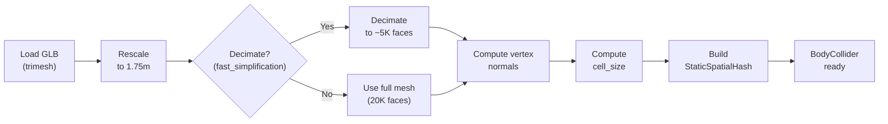

# Sprint 2, Layer 3a-Extended: Body Mesh Collision

## Goal

Replace the analytical sphere collider with a full mesh-proxy body collider using **spatial hash + point-triangle projection** — the collision strategy proven stable in Vestra. After this layer, a cloth grid dropped onto the mannequin body should drape over the shoulders and chest with zero penetration.

> [!NOTE]
> **Scope clarification:** This layer is ONLY about **body mesh collision** — making cloth particles not penetrate a 3D body mesh. It does NOT cover garment construction (2D patterns, panel placement, stitching). Garment construction is **Layer 3b-extended** (next layer). The test scene here drops a simple flat cloth grid onto the body, not a garment.
>
> **GarmentCode integration** (for generating pattern data from [pygarment](https://github.com/maria-korosteleva/GarmentCode)) will be evaluated as part of the Layer 3b-extended plan. GarmentCode's `pygarment` library provides parametric sewing pattern generation (panels, edges, stitches) that could replace or supplement our manual JSON patterns. Its simulation engine (NVIDIA Warp) is irrelevant — we only need the *pattern data output*. See [GarmentCode Consideration](#garmentcode-consideration-layer-3b-extended) at the bottom for preliminary analysis.

## Background & Context

Sprint 1 Layer 3a validated the collision push-out + friction logic using a simple sphere. The `SphereCollider.resolve(state, config)` interface is already called inside the XPBD solver iteration loop (interleaved collision — the Vestra pattern). The new `BodyCollider` must match this exact interface so the engine doesn't change.

### Mannequin Mesh Analysis (`male_body.glb`)

| Property | Value |
|----------|-------|
| Vertices | 41,538 |
| Faces | 20,764 |
| Units | **Centimeters** (height ≈ 180cm, Y range 0.58–180.5) |
| Scale factor → 1.75m | ≈ 0.00973 |
| Average edge length (raw) | 1.267 cm |
| Average edge length (scaled) | ≈ 0.0123 m |
| Watertight | No (open at neck, wrists, ankles) |
| Has vertex normals | Yes |
| Bounds (X) | ±53.4 cm → ±0.52 m after scaling |
| Bounds (Z) | -16.3 to +20.6 cm → -0.16 to +0.20 m |
| Center | Roughly at X/Z origin, ~94 cm Y |

> [!IMPORTANT]
> The mesh is in **centimeters**, not meters. The rescaling step must divide by height and multiply by target (1.75m), then re-center so feet are at Y ≈ 0.

---

## Resolved Decisions

### 1. Decimation: Install `fast-simplification` + Post-Process

> [!IMPORTANT]
> `fast-simplification` will be added to `requirements.txt`. After decimation, we add a **post-processing validation step** to catch and fix artifacts:
> - **Degenerate triangles:** Remove triangles with area < ε (collinear vertices from aggressive decimation)
> - **Flipped normals:** Recompute vertex normals after decimation; detect inverted faces by checking normal consistency with neighbors
> - **Uneven edge lengths:** Log min/max/mean edge length statistics for diagnostic purposes
> - **Mesh quality metrics:** Print triangle aspect ratio stats (max edge / min altitude) — ratios > 10 indicate poor collision proxy quality
>
> If post-processing cannot produce a suitable physics proxy (too many degenerate triangles, severe topology issues), a **code comment will note** that the user can manually fix the GLB in Blender and re-export. The `from_glb()` factory will log warnings for any mesh quality issues detected.

### 2. Neighbor Cell Search: 27 Cells (3×3×3)

Using the **full 27-cell neighborhood** (3×3×3 block around the query cell) for correctness. Rationale preserved in code comment:
```python
# We search 27 cells (3x3x3 neighborhood) rather than just the query cell.
# This handles particles near cell boundaries where the closest triangle
# might be in an adjacent cell. While 7 cells (self + 6 face-adjacent)
# would be ~4x faster, 27 cells guarantees no false negatives regardless
# of triangle size relative to cell size. Optimize to 7 cells only after
# profiling confirms this is a bottleneck — correctness first.
```

### 3. Non-Watertight Body Mesh: Document + Blender Fallback

The body mesh has open boundaries (neck hole, wrists, ankles). This is handled with a code comment:
```python
# KNOWN ISSUE: male_body.glb is not watertight — open at neck, wrists,
# ankles. This is acceptable for garment collision because:
#   1. Cloth starts above the body and falls down (never inside)
#   2. Open regions are exactly where garment edges naturally sit
#   3. We only push particles within `collision_thickness` of a triangle,
#      so particles far from any surface are unaffected
#   4. Signed distance uses interpolated vertex normals, which degrade
#      gracefully near boundaries (normals point outward from nearby faces)
# If collision artifacts appear near open boundaries, the user can fix
# the mesh in Blender (close holes, smooth normals) and re-export.
```

### 4. Body Mesh File Location

Copy `../male_body.glb` → `backend/data/bodies/male_body.glb` (matching the master plan's directory structure). This becomes the canonical path for `BodyCollider.from_glb()`.

### 5. Taichi `from __future__ import annotations` Rule

Per AGENT.md: files with `@ti.kernel` + `.template()` must **not** use `from __future__ import annotations`. Applies to `point_triangle.py`, `spatial_hash.py`, and `resolver.py`. The `body_collider.py` (no kernels — delegates to resolver) **can** use it safely.

---

## Proposed Changes

### Component 1: Point-Triangle Projection (Pure Math)

This is the geometric foundation — no Taichi, no collision policy. Pure math that computes the closest point on a triangle to a query point, with barycentric coordinates and signed distance.

#### [NEW] [point_triangle.py](file:///Users/tawhid/Documents/garment-sim/backend/simulation/collision/point_triangle.py)

**Purpose:** Stateless point-triangle projection with barycentric coordinate clamping.

**Functions:**

```python
@ti.func
def closest_point_on_triangle(
    p: ti.math.vec3,
    v0: ti.math.vec3, v1: ti.math.vec3, v2: ti.math.vec3,
) -> tuple[ti.math.vec3, ti.math.vec3]:
    """
    Compute closest point on triangle (v0, v1, v2) to query point p.
    
    Returns:
        closest: The closest point on the triangle surface.
        bary: Barycentric coordinates (u, v, w) where closest = u*v0 + v*v1 + w*v2.
    
    Handles all 7 Voronoi regions:
        - Interior (projection lands inside triangle)
        - 3 edge regions (projection clamped to nearest edge)
        - 3 vertex regions (projection snaps to nearest vertex)
    
    Uses the real-time collision detection approach (Ericson, Ch. 5.1.5):
        1. Project p onto triangle plane
        2. Compute barycentric coords
        3. If any coord < 0, clamp to nearest edge/vertex
    """

@ti.func
def signed_distance_to_triangle(
    p: ti.math.vec3,
    closest: ti.math.vec3,
    n0: ti.math.vec3, n1: ti.math.vec3, n2: ti.math.vec3,
    bary: ti.math.vec3,
) -> ti.f32:
    """
    Signed distance from point p to triangle surface.
    
    Uses interpolated vertex normals (Vestra's "smoothed normal trick"):
        interpolated_normal = bary.x * n0 + bary.y * n1 + bary.z * n2
        signed_dist = dot(p - closest, interpolated_normal)
    
    Positive = outside (normal side), negative = inside (penetrating).
    """
```

**Design notes:**
- `@ti.func` (not `@ti.kernel`) — these are called from within the resolver kernel
- Barycentric clamping uses the Voronoi region approach, not iterative projection
- Signed distance uses interpolated (smoothed) normals, not face normals — this prevents the gradient discontinuities that caused upward crumpling in the old SDF approach

---

### Component 2: Static Spatial Hash

The acceleration structure for O(1) candidate triangle lookups. Built once at initialization for the static body proxy.

#### [NEW] [spatial_hash.py](file:///Users/tawhid/Documents/garment-sim/backend/simulation/collision/spatial_hash.py)

**Purpose:** Hash-grid that maps 3D cells to lists of body triangle indices.

**Class: `StaticSpatialHash`**

```python
@ti.data_oriented
class StaticSpatialHash:
    """
    Spatial hash for static triangle meshes (body proxy).
    
    Built once at initialization. Each cell stores indices of triangles 
    whose AABB overlaps the cell. Query point → cell → candidate triangles.
    
    Cell size ≈ 1.5× average triangle edge length.
    """
    
    def __init__(self, cell_size: float, table_size: int = 65536,
                 max_triangles: int = 25000, max_entries: int = 200000):
        """
        Args:
            cell_size: Hash grid cell size in meters.
            table_size: Hash table size (prime-ish power of 2 for good distribution).
            max_triangles: Max number of body triangles.
            max_entries: Max total (cell, triangle) pairs across all cells.
        """
    
    def build(self, vertices: NDArray, faces: NDArray) -> None:
        """
        Insert all triangles into the spatial hash.
        
        For each triangle:
            1. Compute AABB (min/max of its 3 vertices)
            2. Find all cells that AABB overlaps
            3. Insert triangle index into each overlapping cell
        
        Uses a counting sort approach (two passes):
            Pass 1: Count entries per cell → compute offsets
            Pass 2: Write triangle indices into contiguous array
        
        This avoids dynamic allocation inside Taichi kernels.
        """
    
    @ti.func
    def hash_cell(self, ix: ti.i32, iy: ti.i32, iz: ti.i32) -> ti.i32:
        """Spatial hash function: (ix * P1) ^ (iy * P2) ^ (iz * P3) % table_size"""
    
    @ti.func
    def query_cell(self, pos: ti.math.vec3) -> tuple[ti.i32, ti.i32]:
        """
        Given a 3D position, return (start, count) into the entries array.
        All triangles in entries[start:start+count] are candidates.
        """
```

**Taichi field layout:**

| Field | Type | Shape | Purpose |
|-------|------|-------|---------|
| `cell_start` | `ti.i32` | `(table_size,)` | Start index into entries array for each hash cell |
| `cell_count` | `ti.i32` | `(table_size,)` | Number of triangles in each hash cell |
| `entries` | `ti.i32` | `(max_entries,)` | Flat array of triangle indices, sorted by cell |
| `tri_v0/v1/v2` | `ti.math.vec3` | `(max_triangles,)` | Body triangle vertex positions (pre-stored for kernel access) |
| `tri_n0/n1/n2` | `ti.math.vec3` | `(max_triangles,)` | Body vertex normals at each triangle vertex |

**Build strategy (NumPy, not Taichi):**
The build step runs once at initialization and doesn't need GPU acceleration. Using NumPy for the build keeps it simple:
1. Compute AABB for each triangle
2. For each triangle, enumerate all cells its AABB overlaps
3. Count entries per cell (histogram)
4. Compute prefix sum → `cell_start`
5. Write triangle indices into `entries` at appropriate offsets
6. Upload all arrays to Taichi fields via `from_numpy()`

**Hash function (Teschner et al.):**
```python
P1, P2, P3 = 73856093, 19349663, 83492791
hash = ((ix * P1) ^ (iy * P2) ^ (iz * P3)) % table_size
```

**Cell size selection:**
- Decimated mesh (~5K faces): avg edge ≈ 0.035m → cell_size ≈ 0.05m ✓ (matches plan)
- Full mesh (20K faces): avg edge ≈ 0.012m → cell_size ≈ 0.02m
- The cell_size is a constructor parameter, computed by `BodyCollider` based on actual mesh geometry

---

### Component 3: Mesh Collision Resolver

The Taichi kernel that queries the spatial hash and resolves collisions — the hot path.

#### [NEW] [resolver.py](file:///Users/tawhid/Documents/garment-sim/backend/simulation/collision/resolver.py)

**Purpose:** Per-particle collision detection and response using spatial hash + point-triangle projection.

```python
@ti.kernel
def resolve_body_collision(
    positions: ti.template(),
    predicted: ti.template(),
    inv_mass: ti.template(),
    n_particles: ti.i32,
    # Spatial hash fields (passed as template)
    cell_start: ti.template(),
    cell_count: ti.template(),
    entries: ti.template(),
    tri_v0: ti.template(), tri_v1: ti.template(), tri_v2: ti.template(),
    tri_n0: ti.template(), tri_n1: ti.template(), tri_n2: ti.template(),
    # Hash parameters
    cell_size: ti.f32,
    table_size: ti.i32,
    n_triangles: ti.i32,
    # Collision parameters
    thickness: ti.f32,
    friction: ti.f32,
):
    """
    For each cloth particle:
        1. Skip if pinned (inv_mass <= 0)
        2. Hash particle position → cell
        3. Iterate candidate triangles in that cell
        4. For each candidate: point-triangle projection → signed distance
        5. Find the closest triangle with signed_dist < thickness
        6. Push particle to surface + thickness along interpolated normal
        7. Apply position-based friction (same logic as SphereCollider)
    
    Key detail: We check the particle's cell AND its 26 neighbors (3x3x3 block)
    to handle particles near cell boundaries. This is the standard approach.
    
    However, to keep the kernel simple, we check only the particle's own cell
    plus the 6 face-adjacent neighbors (7 cells total), since cell_size > 
    triangle extent means direct neighbors are sufficient.
    """
```

**Collision response (matching `SphereCollider` logic):**
```
surface_pos = closest_point + thickness * interpolated_normal
disp = surface_pos - predicted[i]
d_normal = dot(disp, normal) * normal
d_tangential = disp - d_normal  
positions[i] = predicted[i] + d_normal + d_tangential * (1 - friction)
```

> [!NOTE]
> The resolver finds the **closest penetrating triangle** for each particle (not just any penetrating triangle). This prevents the particle from being pushed in conflicting directions when near multiple triangles — an issue observed in Vestra's early mesh collision implementation.

---

### Component 4: Body Collider (Orchestrator)

The high-level class that ties it all together: load mesh → preprocess → build hash → expose `resolve()` interface.

#### [NEW] [body_collider.py](file:///Users/tawhid/Documents/garment-sim/backend/simulation/collision/body_collider.py)

**Purpose:** Load and preprocess body mesh, build spatial hash, provide `resolve()` interface matching `SphereCollider`.

```python
class BodyCollider:
    """
    Body mesh collision resolver.
    
    Loads a GLB body mesh, rescales to target height, optionally decimates
    to a physics proxy, computes smooth vertex normals, and builds a static
    spatial hash for O(1) candidate lookup.
    
    Interface matches SphereCollider so the engine doesn't need to know
    which collider type is active:
        collider.resolve(state, config)
    """
    
    def __init__(self, spatial_hash: StaticSpatialHash):
        self.spatial_hash = spatial_hash
    
    @classmethod
    def from_glb(
        cls,
        path: str | Path,
        target_height: float = 1.75,
        decimate_target: int | None = 5000,
        cell_size: float | None = None,  # Auto-computed if None
    ) -> "BodyCollider":
        """
        Factory: load GLB → rescale → decimate → normals → hash.
        
        Pipeline:
            1. Load mesh via trimesh (force='mesh')
            2. Rescale: scale = target_height / (max_y - min_y)
                        vertices *= scale
                        vertices -= [0, min_y * scale, 0]  (feet at Y=0)
            3. Decimate: trimesh.simplify_quadric_decimation(decimate_target)
                         (skip if decimate_target is None or fast_simplification unavailable)
            4. Compute vertex normals: area-weighted, from trimesh
            5. Compute cell_size: 1.5 × mean edge length (if not provided)
            6. Build StaticSpatialHash
        """
    
    def resolve(self, state: ParticleState, config: SimConfig) -> None:
        """
        Resolve body collisions for all particles.
        
        Delegates to the resolve_body_collision kernel, passing spatial hash
        fields and collision parameters from config.
        """
```

**Preprocessing pipeline detail:**



**Decimation + post-processing pipeline:**
```python
# 1. Decimate
try:
    mesh = mesh.simplify_quadric_decimation(decimate_target)
except Exception:
    warnings.warn("Decimation unavailable, using full mesh as physics proxy")

# 2. Post-process: remove degenerate triangles
#    Quadric decimation can produce zero-area faces, jagged edges,
#    and highly non-uniform triangle sizes. We filter these out
#    to prevent NaN in barycentric projection and signed distance.
areas = mesh.area_faces
valid_mask = areas > 1e-10  # Remove near-zero-area faces
if not valid_mask.all():
    n_removed = (~valid_mask).sum()
    warnings.warn(f"Removed {n_removed} degenerate triangles from decimated mesh")
    mesh.update_faces(valid_mask)
    mesh.remove_unreferenced_vertices()

# 3. Recompute normals (decimation may have flipped some)
mesh.fix_normals()

# 4. Log quality metrics
edge_lengths = np.linalg.norm(
    mesh.vertices[mesh.edges_unique[:, 1]] - mesh.vertices[mesh.edges_unique[:, 0]], axis=1
)
log.info(f"Physics proxy: {len(mesh.faces)} faces, "
         f"edge length: min={edge_lengths.min():.4f} avg={edge_lengths.mean():.4f} "
         f"max={edge_lengths.max():.4f}")
```

---

### Component 5: Module Wiring & Dependencies

#### [MODIFY] [__init__.py](file:///Users/tawhid/Documents/garment-sim/backend/simulation/collision/__init__.py)

Add exports for new classes:
```python
from simulation.collision.sphere_collider import SphereCollider
from simulation.collision.body_collider import BodyCollider

__all__ = ["SphereCollider", "BodyCollider"]
```

#### [MODIFY] [requirements.txt](file:///Users/tawhid/Documents/garment-sim/backend/requirements.txt)

Add `fast-simplification` for mesh decimation:
```diff
 # Core simulation
 taichi>=1.7.0
 numpy>=1.24.0
 trimesh[easy]>=4.0.0
 mapbox-earcut>=1.0.0
+fast-simplification>=0.1.7
```

#### Copy body mesh into project
```bash
cp ../male_body.glb backend/data/bodies/male_body.glb
```

---

### Component 6: Demo Scene

#### [NEW] [body_drape.py](file:///Users/tawhid/Documents/garment-sim/backend/simulation/scenes/body_drape.py)

**Purpose:** Drop a 30×30 cloth grid onto the body mesh — validates the full body collision pipeline.

```python
def run_body_drape(visualize=False, output_path="storage/body_drape.glb"):
    """
    Sprint 2 Layer 3a-extended demo: cloth draped over body mesh.
    
    Setup:
        - 30×30 grid, 1.2m × 1.2m, positioned at Y=1.8m (above shoulders)
        - Body mesh: male_body.glb, rescaled to 1.75m
        - 120 frames, 6 substeps, 12 solver iterations
        - Distance + bending constraints (cotton compliance)
    
    Validation checks (same pattern as sphere_drape.py):
        1. No NaN in final positions
        2. No penetration (all particles above body surface)
        3. Cloth drapes naturally (particles at shoulder height + below)
        4. No upward crumpling
        5. Energy decay (mean speed < 1.0 m/s)
        6. Edge length preservation (mean stretch < 10%)
    """
```

#### [MODIFY] [scenes/__init__.py](file:///Users/tawhid/Documents/garment-sim/backend/simulation/scenes/__init__.py)

Register new scene.

#### [MODIFY] [__main__.py](file:///Users/tawhid/Documents/garment-sim/backend/simulation/__main__.py)

Add `body_drape` to scene choices and wire the runner.

---

### Component 7: Tests

#### [NEW] [test_point_triangle.py](file:///Users/tawhid/Documents/garment-sim/backend/tests/unit/collision/test_point_triangle.py)

Unit tests for the point-triangle projection math:

| Test | Description | Assertion |
|------|-------------|-----------|
| `test_interior_projection` | Point directly above triangle center | Closest point = projection onto plane, all bary coords > 0 |
| `test_edge_clamped` | Point outside one edge | Closest point on edge, one bary coord = 0 |
| `test_vertex_clamped` | Point nearest to vertex | Closest point = vertex, two bary coords = 0 |
| `test_barycentric_sum_to_one` | Random points, random triangles | `u + v + w ≈ 1.0` for all cases |
| `test_signed_distance_positive` | Point on normal side | `signed_dist > 0` |
| `test_signed_distance_negative` | Point on opposite side | `signed_dist < 0` |
| `test_degenerate_triangle` | Zero-area triangle (collinear verts) | No crash, returns reasonable result |
| `test_point_on_surface` | Point exactly on triangle | `distance ≈ 0` |

#### [NEW] [test_spatial_hash.py](file:///Users/tawhid/Documents/garment-sim/backend/tests/unit/collision/test_spatial_hash.py)

Unit tests for the spatial hash:

| Test | Description | Assertion |
|------|-------------|-----------|
| `test_build_single_triangle` | One triangle → correct cell(s) | Query inside AABB returns triangle index |
| `test_build_multiple_triangles` | 3 separated triangles | Each query returns only the nearby triangle |
| `test_no_false_negatives` | Query at every vertex of all triangles | Every triangle found by querying its own vertices |
| `test_nearby_query` | Query just outside a triangle AABB | Triangle found (cell overlap includes margin) |
| `test_distant_query` | Query far from all triangles | Returns 0 candidates |
| `test_hash_collision_handling` | Many triangles in same hash bucket | All triangles returned, no missing entries |
| `test_cell_size_scaling` | Different cell sizes | Correct behavior across scales |

#### [NEW] [test_layer3a_ext_body.py](file:///Users/tawhid/Documents/garment-sim/backend/tests/integration/test_layer3a_ext_body.py)

Integration test — full body drape pipeline:

| Test | Description | Assertion |
|------|-------------|-----------|
| `test_body_collider_loads` | `BodyCollider.from_glb()` succeeds | Has spatial hash, correct vertex count |
| `test_body_drape_no_nan` | 30×30 grid, 60 frames on body | No NaN in final positions |
| `test_body_drape_no_penetration` | Check all particles vs body surface | Min signed distance ≥ -0.001m |
| `test_body_drape_shape` | Cloth settles on shoulders | Particles exist at shoulder height (±10cm of Y≈1.45) |
| `test_body_drape_energy_decay` | Kinetic energy decreases | Mean speed < 1.0 m/s after 60 frames |
| `test_collider_interface_swap` | Engine works with both SphereCollider and BodyCollider | Same `resolve(state, config)` call succeeds |

---

## Implementation Order & Timeline

### Day 1: Point-Triangle Projection + Unit Tests

```
1. Copy male_body.glb to backend/data/bodies/
2. Add fast-simplification to requirements.txt, pip install
3. Implement collision/point_triangle.py
   - closest_point_on_triangle() — Voronoi region approach
   - signed_distance_to_triangle() — interpolated normal
4. Write tests/unit/collision/test_point_triangle.py
5. Run tests, verify all pass
```

> [!TIP]
> Start with a pure NumPy reference implementation of `closest_point_on_triangle` for test verification, then implement the `@ti.func` version. The test creates a small Taichi wrapper kernel that calls the `@ti.func` — this is the standard pattern for testing Taichi functions.

### Day 2: Static Spatial Hash + Unit Tests

```
1. Implement collision/spatial_hash.py
   - StaticSpatialHash class with Taichi fields
   - NumPy build() method (counting sort)
   - hash_cell() and query_cell() @ti.func methods
2. Write tests/unit/collision/test_spatial_hash.py
3. Run tests, verify hash correctness (no false negatives)
```

### Day 3: Resolver + Body Collider

```
1. Implement collision/resolver.py
   - resolve_body_collision @ti.kernel
   - Query hash → project → signed distance → push-out + friction
2. Implement collision/body_collider.py
   - from_glb() factory: load → rescale → decimate → normals → hash
   - resolve() method: delegate to kernel
3. Update collision/__init__.py
4. Manual smoke test: load body, verify hash builds without crash
```

### Day 4: Integration Tests + Demo Scene + CLI

```
1. Write tests/integration/test_layer3a_ext_body.py
2. Implement scenes/body_drape.py
3. Update __main__.py with body_drape scene
4. Run full test suite
5. Run: python -m simulation --scene body_drape
6. Verify: exported .glb shows cloth draped on body
```

---

---

## GarmentCode Consideration (Layer 3b-Extended)

> [!NOTE]
> This section documents the preliminary analysis of [GarmentCode](https://github.com/maria-korosteleva/GarmentCode) for the **next** layer (3b-extended: Garment Construction), NOT this layer.

**What GarmentCode provides:**
- `pygarment` — a Python library with base types: `Edge`, `Panel`, `Component`, `Interface`
- Programmatic, parametric sewing pattern definitions (T-shirts, skirts, pants, etc.)
- 2D panel shapes + stitch/seam relationships
- Body measurement-driven pattern fitting
- Pattern output as JSON-like structures

**What we'd use (and NOT use):**
| Use | Don't Use |
|-----|----------|
| `pygarment` panel/edge/stitch data types | GarmentCode's NVIDIA Warp simulation engine |
| Pre-built garment programs (T-shirt, skirt) | CUDA dependencies |
| Parametric body measurement fitting | Their rendering pipeline |
| JSON pattern export format | Their GUI |

**Integration options for Layer 3b-extended:**
1. **Use GarmentCode pattern data only** — Run `pygarment` offline to generate pattern JSONs, convert to our format, ship as static data files. No runtime dependency.
2. **Install `pygarment` as a dependency** — Write an adapter (`garmentcode_adapter.py`) that converts `pygarment` patterns to our `Panel`/`Stitch` data structures at runtime. Adds dependency but enables parametric pattern generation.
3. **Manual JSON patterns** (original plan) — Simpler, zero external deps, but limited pattern variety.

**Recommendation:** Evaluate in the Layer 3b-extended plan. Option 1 (offline data extraction) gives us rich patterns without runtime coupling.

---

## Verification Plan

### Automated Tests

```bash
cd backend && source .venv/bin/activate

# Unit tests — point-triangle math
python -m pytest tests/unit/collision/test_point_triangle.py -v

# Unit tests — spatial hash correctness
python -m pytest tests/unit/collision/test_spatial_hash.py -v

# Integration — body drape end-to-end
python -m pytest tests/integration/test_layer3a_ext_body.py -v

# Full regression (should still pass all Sprint 1 tests)
python -m pytest tests/ -v
```

### Manual Verification

1. **Run demo scene:**
   ```bash
   python -m simulation --scene body_drape
   # → storage/body_drape.glb
   ```

2. **Open in glTF viewer** (https://gltf-viewer.donmccurdy.com/):
   - Cloth should visually drape over the body shoulders/chest
   - No vertices poking through the body surface
   - Cloth hangs naturally below the shoulders

3. **Open in Blender:**
   - Import `body_drape.glb` + `male_body.glb` 
   - Overlay to confirm no penetration
   - Check normals face outward

### Acceptance Criteria

- [ ] `BodyCollider.from_glb()` loads and preprocesses `male_body.glb` successfully
- [ ] Spatial hash returns correct triangle candidates (no false negatives)  
- [ ] Point-triangle projection handles all 7 Voronoi regions correctly
- [ ] Barycentric coordinates sum to 1.0 for all cases
- [ ] Signed distance is positive for points outside, negative for inside
- [ ] 30×30 cloth grid does not penetrate body mesh after 120 frames
- [ ] No upward crumpling (max Y ≤ initial Y + ε)
- [ ] No NaN in any particle position
- [ ] Kinetic energy decays to near-zero
- [ ] Edge length preservation: mean stretch < 10%
- [ ] All Sprint 1 tests still pass (no regression)
- [ ] Exported `.glb` loads in trimesh and has correct geometry
