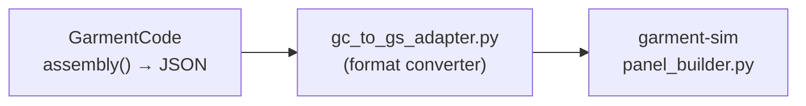

# GarmentCode × garment-sim: Integration Analysis

## Executive Summary

GarmentCode is a **parametric sewing pattern design system** (SIGGRAPH Asia 2023, ETH Zurich) that programmatically generates 2D pattern pieces with precise stitching semantics, body-measurement-driven sizing, and a production-grade mesh generation pipeline. Our **garment-sim** is a **physics simulation engine** (XPBD + Taichi) that takes pre-built 2D panels, stitches them via constraint-based sewing, and drapes them over a body mesh.

The two systems are **complementary at different layers of the pipeline** — GarmentCode excels at pattern definition and mesh preparation; garment-sim excels at physics simulation and real-time rendering. Neither alone delivers the full CLO3D workflow.


---

## 1. Architecture Comparison

### 1.1 Pattern Representation

| Aspect | GarmentCode | garment-sim |
|--------|-------------|-------------|
| **Pattern format** | Custom JSON with `panels`, `stitches`, `properties` | Custom JSON with `panels`, `stitches`, `fabric` |
| **Edge types** | `Edge` (straight), `CircleEdge` (arc), `CurveEdge` (Bezier) | Straight polygon vertices only |
| **Curvature support** | Full: quadratic/cubic Bézier, circular arcs with `svgpathtools` | Bézier curves sampled to polylines at generation time |
| **Stitching semantics** | `Interface` → `StitchingRule` with auto-matching, ruffle coefficients, right/wrong side | `edge_a`/`edge_b` as `[v_start, v_end]` pairs — manual specification |
| **Placement** | 3D translation + scipy `Rotation` (full Euler XYZ) | Position + `rotation_y_deg` + `rotation_x_deg` |
| **Body parametrization** | Full body measurement YAML (bust, waist, head_l, shoulder_incl, etc.) | `mannequin_profile.json` with landmarks from mesh analysis |
| **Garment library** | Bodice, T-shirt, Pants, Skirts (paneled, circle, godet), Sleeves, Collars, Bands | Tank top only (2-panel, side+shoulder seams) |

> [!IMPORTANT]
> GarmentCode's JSON format is close but **not identical** to garment-sim's. The key differences:
> - GarmentCode stores vertices as a flat list and edges reference those by index; garment-sim embeds vertices inline in `vertices_2d`.
> - GarmentCode stitches use `{panel: name, edge: geometric_id}`; garment-sim uses `{panel_a: id, edge_a: [v_start, v_end]}`.
> - GarmentCode rotations are XYZ Euler in degrees; garment-sim uses explicit `rotation_x_deg` + `rotation_y_deg` fields.

### 1.2 Mesh Generation Pipeline

| Stage | GarmentCode | garment-sim |
|-------|-------------|-------------|
| **Triangulation** | CGAL `Mesh_2_Constrained_Delaunay_triangulation_2` with quality criteria | `mapbox-earcut` + Steiner point insertion |
| **Vertex density** | `mesh_resolution` controls edge sampling (cm-scale), then CGAL refines interior | `target_edge` param (default 0.020m) for boundary and interior |
| **Stitch vertex matching** | `collapse_stitch_vertices()` — merges identical vertices across panels, stores segmentation | `_find_edge_particles()` — walks boundary to create stitch pairs, then linearly subsamples |
| **Normal computation** | `set_panel_norm()` using bounding box cross products | Computed during simulation (face winding correction for cylindrical sleeves) |
| **Edge label propagation** | Labels flow from edges to stitches to vertex labels (for attachment constraints) | No edge labeling system |

> [!NOTE]
> GarmentCode's CGAL-based triangulation is substantially more robust for complex concave polygons and curved edges. Its `BoxMesh` class also performs norm-aware vertex collapse at stitch boundaries — a critical step that garment-sim currently handles via manual `stitch_pairs` resolution.

### 1.3 Simulation Layer

| Aspect | GarmentCode (via NVIDIA Warp) | garment-sim (Taichi XPBD) |
|--------|-------------------------------|---------------------------|
| **Solver** | NVIDIA Warp `XPBDIntegrator` (GPU-first, CUDA graphs) | Custom XPBD in Taichi kernels (CPU/GPU) |
| **Constraints** | `edge_ke`, `tri_ke`, `spring_ke` (stiffness-based FEM) | Compliance-based distance + bending + stitch |
| **Self-collision** | `particle_particle`, `triangle_particle`, `edge_edge` (Warp built-in) | Dynamic centroid hash, 1-ring exclusion, euclidean penetration gate |
| **Body collision** | `wp.sim.Mesh` + `soft_contact` (ke/kd/kf/mu) | `BodyCollider` (static spatial hash + point-triangle projection) |
| **Body smoothing** | Progressive: Laplacian-smoothed body recovers over frames | Not implemented |
| **Attachment** | Waist/collar vertex attachment constraints (configurable labels) | Not implemented |
| **Panel assignment** | `panel_assignment.py` — assigns cloth particles to body regions for collision filtering | Not implemented — uniform collision against full body |
| **Sewing** | Done at mesh level (collapsed vertices = pre-sewn) | Spring-like stitch constraints + progressive compliance ramp |

---

## 2. What GarmentCode Offers That We Lack

### 2.1 Parametric Pattern Programs (⭐ Highest Value)

GarmentCode's crown jewel is [garment_programs/](file:///Users/tawhid/Documents/GarmentCode/assets/garment_programs/) — Python classes that **programmatically generate garment patterns from body measurements**:

- [tee.py](file:///Users/tawhid/Documents/GarmentCode/assets/garment_programs/tee.py) — T-shirt (front/back half-panels, shoulder inclination, bust width fractions)
- [bodice.py](file:///Users/tawhid/Documents/GarmentCode/assets/garment_programs/bodice.py) — Fitted bodice with darts
- [sleeves.py](file:///Users/tawhid/Documents/GarmentCode/assets/garment_programs/sleeves.py) — Sleeve panels with armhole projection
- [pants.py](file:///Users/tawhid/Documents/GarmentCode/assets/garment_programs/pants.py) — Trousers with inseam/outseam
- [skirt_paneled.py](file:///Users/tawhid/Documents/GarmentCode/assets/garment_programs/skirt_paneled.py) — Multi-panel skirts
- [collars.py](file:///Users/tawhid/Documents/GarmentCode/assets/garment_programs/collars.py) — Four collar types
- [circle_skirt.py](file:///Users/tawhid/Documents/GarmentCode/assets/garment_programs/circle_skirt.py) — Circular skirts with godet inserts

Each uses the `Interface` system for automatic stitch matching, meaning panels **self-describe** how they connect. Our `pattern_generator.py` currently only builds tank tops with hard-coded Bézier vertices.

### 2.2 Pattern DSL: Edge/Panel/Interface/Component

The core type hierarchy:

```
BaseComponent (abstract)
├── Panel — single flat piece with edges, 2D→3D placement, autonorm
│   ├── edges: EdgeSequence (loop of Edge/CircleEdge/CurveEdge)
│   ├── interfaces: dict[str, Interface]  — named stitch-able edge groups
│   └── stitching_rules: Stitches — internal stitches (e.g., darts)
└── Component — composite of Panels/Components
    ├── subs: list[BaseComponent]
    ├── recursive translate/rotate/mirror operations
    └── assembly() → merges all sub-patterns into unified VisPattern
```

Key capabilities missing from garment-sim:
1. **Automatic interface matching** — `StitchingRule` subdivides edges to ensure both sides of a stitch have matching vertex counts/fractions
2. **Ruffle coefficients** — `Interface(panel, edges, ruffle=1.5)` automatically extends edges for gathers
3. **Mirror operations** — `panel.mirror()` handles vertex reflection, rotation fix, and auto-norm
4. **Dart insertion** — `panel.add_dart(shape, edge, offset)` cuts into edges and generates self-stitches
5. **Placement-by-interface** — `place_by_interface(self_int, other_int)` snaps components by their stitch boundaries

### 2.3 CGAL Mesh Generation

GarmentCode's [boxmeshgen.py](file:///Users/tawhid/Documents/GarmentCode/pygarment/meshgen/boxmeshgen.py) performs:
1. Edge-density-aware vertex sampling (Bézier arc length parameterization)
2. CGAL Constrained Delaunay Triangulation with mesh quality criteria (`angle ≥ 0.125`, `size ≤ 1.43 × resolution`)
3. Domain marking (inside/outside polygon detection for non-convex shapes)
4. Manifold checking per panel
5. Stitch vertex collapse across panels with segmentation tracking

> [!WARNING]
> The CGAL dependency (`python-CGAL`) is **non-trivial to install** — it requires CGAL headers and compilation. This is a significant friction point for integration.

### 2.4 Simulation Tricks

GarmentCode's [Cloth](file:///Users/tawhid/Documents/GarmentCode/pygarment/meshgen/garment.py) class (Warp-based) has several techniques we could adapt:

1. **Body smoothing** — Start with a Laplacian-smoothed body and progressively restore detail. Prevents early-frame cloth snagging on body features.
2. **Panel-to-body-part assignment** — Each cloth particle is labeled (left_arm, right_leg, body, etc.) and collision is filtered per body region. This prevents skirt panels from colliding with arms.
3. **Attachment constraints** — Waist-level, collar, and strapless-top vertex constraints that hold the garment in place during sewing, then release.
4. **Zero-gravity sewing** — Start with gravity=0 for N frames to let stitches pull closed, then enable gravity.
5. **Body collision face filters** — Different cloth particles can ignore different body mesh faces (e.g., skirt panels ignore arm geometry).

---

## 3. Integration Strategies

### Strategy A: **JSON Adapter** (Lowest Effort, Highest ROI)

Build a translator from GarmentCode's serialized JSON format to garment-sim's pattern JSON format.



**Steps:**
1. Write `gc_to_gs_adapter.py` that:
   - Reads GarmentCode `_specification.json` (output of `VisPattern.serialize()`)
   - Converts `{panels: {name: {vertices, edges, translation, rotation}}}` → `{panels: [{id, vertices_2d, placement}]}`
   - Converts edges with curvature (circle/Bézier) into polyline vertices by sampling the curves
   - Converts `stitches: [{panel, edge}, {panel, edge}]` → `{panel_a, edge_a: [v_start, v_end], panel_b, edge_b}`
   - Maps XYZ Euler rotations → `rotation_x_deg` + `rotation_y_deg` (or extend garment-sim to accept full Euler)

**Pros:** Minimal changes to either codebase. Unlocks entire GarmentCode garment library.
**Cons:** Loses curve fidelity (polyline approximation). Requires coordinate system alignment.

### Strategy B: **Use GarmentCode as Pattern Library** (Medium Effort)

Import the `pygarment.garmentcode` package directly and call `assembly()` to generate patterns, then feed them through the adapter.

```python
import pygarment as pyg
from assets.garment_programs.tee import TorsoFrontHalfPanel

body = load_body_measurements("assets/bodies/mean_all.yaml")
design = load_design_params("assets/design_params/default.yaml")

front = TorsoFrontHalfPanel("front", body, design)
# ... compose, stitch, assembly()
pattern = garment.assembly()
gs_pattern = gc_to_gs_adapter(pattern.spec)
```

**Pros:** Full parametric control. Body-measurement-driven sizing. All garment types.
**Cons:** Requires installing pygarment dependencies (scipy, svgpathtools, cairosvg). Body measurement format alignment.

### Strategy C: **Replace garment-sim Triangulation with CGAL** (High Effort, High Quality)

Swap `mapbox-earcut` + Steiner insertion with GarmentCode's CGAL pipeline.

**Pros:** Better mesh quality for complex shapes (concave, curved edges). Proven manifold checks.
**Cons:** CGAL compilation dependency. Significant refactor of `triangulation.py` and `panel_builder.py`.

### Strategy D: **Adopt GarmentCode Simulation Infrastructure** (Very High Effort, Not Recommended)

Replace Taichi XPBD with NVIDIA Warp. Would gain body smoothing, panel assignment, and attachment constraints — but would lose all of garment-sim's carefully tuned solver, collision system, and visualizer.

> [!CAUTION]
> Strategy D would essentially mean starting over. Not recommended given the maturity of garment-sim's physics stack (9 sprints of iteration, proven draping quality).

---

## 4. Recommended Integration Roadmap

### Phase 1: JSON Adapter + Pattern Library (Strategy A+B)
**Effort: 1–2 days**

| Task | Details |
|------|---------|
| `gc_to_gs_adapter.py` | Format converter: GarmentCode JSON → garment-sim JSON |
| Curve sampling | Sample CircleEdge/CurveEdge into polyline vertices at configurable density |
| Rotation mapping | Convert XYZ Euler → position + rotation_x/y_deg (or extend `_apply_placement()`) |
| Stitch remapping | Map `{panel, edge_geometric_id}` → `{panel_a, edge_a: [v_start, v_end]}` |
| Validation | Generate a T-shirt via GarmentCode, convert, simulate in garment-sim |

### Phase 2: Adopt Simulation Techniques (Cherry-Pick from Strategy D)
**Effort: 2–3 days each**

| Technique | Value | Implementation |
|-----------|-------|----------------|
| **Zero-gravity sewing** | ⭐⭐⭐ Already partially implemented (2-stage SEW/DRAPE) | No-op — already done |
| **Body smoothing** | ⭐⭐ Reduces early-frame snagging | Add Laplacian smoothing to mannequin mesh, progressively restore over frames |
| **Attachment constraints** | ⭐⭐ Prevents garments from sliding off during draping | Add waist/collar/strapless pin constraints with timed release |
| **Panel-to-body assignment** | ⭐ Useful for complex garments (dresses, pants) | Assign particles to body regions, skip irrelevant body faces in collision |

### Phase 3: Expand Garment Library
**Effort: 3–5 days**

- Use GarmentCode to generate T-shirts, polos, dresses, skirts, pants
- Build a pattern catalog (pre-generated JSONs in `data/patterns/`)
- Add a pattern selector to the frontend viewer
- Connect to mannequin profile for size-driven generation

---

## 5. Key Challenges & Risks

### 5.1 Coordinate System Mismatch
GarmentCode uses **centimeters** with Y-up; garment-sim uses **meters** with Y-up. All translations, vertex positions, and edge lengths need scaling by `0.01`. GarmentCode's internal placement (`point_to_3D`) uses a panel norm that faces outward from world origin — garment-sim uses explicit rotation parameters.

### 5.2 Stitch Semantics Gap
GarmentCode's `StitchingRule` performs **automatic edge subdivision** to ensure matching stitch vertex counts — this is a sophisticated algorithm in [connector.py](file:///Users/tawhid/Documents/GarmentCode/pygarment/garmentcode/connector.py). Garment-sim's `_find_edge_particles()` does a simpler linear subsample with a ratio-based heuristic. For complex garments (uneven armholes matched to sleeve caps), GarmentCode's approach is more robust.

### 5.3 Curve Fidelity Loss
Converting Bézier/circular arc edges to polylines loses smooth curvature. For simulation purposes this is acceptable (the triangulator subdivides further), but for pattern visualization and export the approximation matters. A density of ~5 points per curve segment should suffice.

### 5.4 CGAL Dependency
If we want GarmentCode's triangulation quality, we'd need `python-CGAL`, which requires:
- CGAL system library (`brew install cgal` on macOS)
- Swig bindings compilation
- This is a non-trivial CI/deployment burden

**Recommendation:** Stay with `mapbox-earcut` for now. GarmentCode's advantage is mostly for concave panels with complex curves — our current Steiner-point-enhanced earcut handles the patterns we need.

### 5.5 Warp vs Taichi

GarmentCode's simulation uses NVIDIA Warp (`wp.sim`), which is tightly coupled to its `Cloth` class. The algorithms (body smoothing, panel assignment, attachment) are conceptually transferable but the implementation must be rewritten in Taichi kernels. This is straightforward for body smoothing and attachments, but panel-to-body assignment for collision filtering would require extending the spatial hash infrastructure.

### 5.6 Body Measurement Alignment

GarmentCode uses a rich YAML body measurement dict (`bust`, `waist`, `back_width`, `shoulder_incl`, `armscye_depth`, `waist_line`, `head_l`, etc.) from [GarmentMeasurements](https://github.com/mbotsch/GarmentMeasurements). Garment-sim uses `mannequin_profile.json` with landmark positions from Blender mesh analysis. These overlap but aren't identical — a measurement adapter would be needed for full parametric garment generation.

---

## 6. What NOT to Use from GarmentCode

| Component | Reason to Skip |
|-----------|----------------|
| `mayaqltools/` | Maya/Qualoth integration — outdated, replaced by Warp |
| `data_config.py` | Dataset generation infrastructure — not relevant to our use case |
| `pattern_data_sim.py`, `pattern_sampler.py` | Batch dataset generation — we need single-garment, not statistical sampling |
| `gui/` | GarmentCode's own configurator — we have our own Next.js viewer |
| `boxmeshgen.py` (full class) | The full BoxMesh pipeline is entangled with CGAL and Warp-specific formats |
| NVIDIA Warp simulation | Redundant with our Taichi XPBD solver, which is more tuned for our needs |

---

## 7. Summary of Recommendations

| Priority | Action | Value | Effort |
|----------|--------|-------|--------|
| 🟢 **P0** | Build `gc_to_gs_adapter.py` JSON format converter | Unlocks entire garment library | 1 day |
| 🟢 **P0** | Import garment programs (tee, bodice, sleeves) as pattern sources | Rich parametric garments | 1 day |
| 🟡 **P1** | Adopt body-smoothing technique in simulation | Reduces early snagging | 2 days |
| 🟡 **P1** | Add attachment constraints (waist pin, collar pin) | Better draping stability | 2 days |
| 🟡 **P1** | Create a pre-generated pattern catalog from GarmentCode programs | Broader garment variety | 2 days |
| 🔵 **P2** | Implement panel-to-body collision filtering | Needed for pants/dresses | 3 days |
| 🔵 **P2** | Align body measurement formats (YAML ↔ mannequin_profile) | Full parametric sizing | 1 day |
| ⚪ **P3** | Consider CGAL triangulation for complex curved panels | Quality improvement | 3+ days |

> [!TIP]
> The JSON adapter (P0) is the single highest-ROI action. It unlocks T-shirts, bodices, pants, skirts, sleeves, and collars from GarmentCode's tested codebase — all flowing through our existing simulation and viewer pipeline with zero physics changes required.
