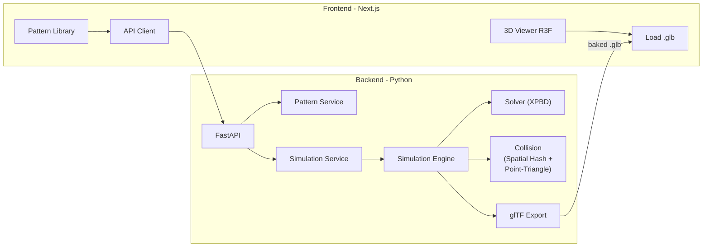
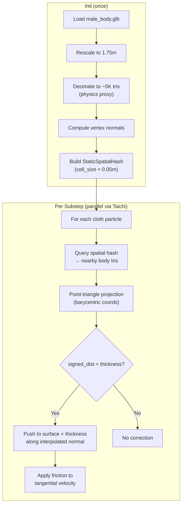

# Phase 1 MVP — Revised Implementation Plan

## Confirmed Decisions

| Decision | Choice | Rationale |
|---|---|---|
| **Solver** | XPBD (Phase 1), PD upgrade path (Phase 2) | XPBD is proven in Vestra, unconditionally stable, faster to first demo |
| **Collision** | Mesh-proxy + spatial hash + point-triangle projection | Proven in Vestra (Jan 16–Feb 9). Smooth normals, no voxel artifacts, interleaved solving |
| **Language** | Taichi Lang (Python) | Native GPU (Metal/Vulkan/CUDA), Python-native, JIT compilation |
| **Self-collision** | Deferred to Phase 2 | Both Vestra and Vistio proved this is a separate engineering challenge |
| **Output** | Bake to glTF | Simulate server-side, serve static `.glb` to frontend |
| **Body model** | `male_body.glb` (41.5K verts, rescale to ~1.75m) | Suitable. Decimate a physics copy for collision proxy |

---

## Architecture



### Solver Abstraction (Design for PD Upgrade)

The solver is behind a `Protocol` interface so it can be swapped without touching collision, mesh, pattern, or export code:

```python
# solver/base.py
class SolverStrategy(Protocol):
    def initialize(self, state: ParticleState, constraints: ConstraintSet, config: SimConfig) -> None: ...
    def step(self, state: ParticleState, dt: float) -> None: ...

# solver/xpbd.py — Phase 1 implementation
class XPBDSolver(SolverStrategy): ...

# solver/pd.py — Phase 2 upgrade (future)
class PDSolver(SolverStrategy): ...
```

Everything outside the solver (collision, constraints data structures, mesh pipeline, export) remains unchanged when upgrading.

---

## Project Structure

```
/Users/tawhid/Documents/garment-sim/
│
├── backend/
│   ├── simulation/                     # Physics engine (standalone, no web deps)
│   │   ├── __init__.py
│   │   │
│   │   ├── core/                       # Orchestration + state
│   │   │   ├── __init__.py
│   │   │   ├── engine.py               # SimulationEngine.run() → SimResult
│   │   │   ├── config.py               # SimConfig dataclass
│   │   │   └── state.py                # ParticleState (SoA Taichi fields)
│   │   │
│   │   ├── solver/                     # Solver strategies
│   │   │   ├── __init__.py
│   │   │   ├── base.py                 # SolverStrategy Protocol
│   │   │   ├── xpbd.py                 # XPBD Gauss-Seidel (Phase 1)
│   │   │   └── integrator.py           # predict_positions, update_velocities
│   │   │
│   │   ├── constraints/                # Constraint types (solver-agnostic data)
│   │   │   ├── __init__.py
│   │   │   ├── distance.py             # Edge length preservation
│   │   │   ├── bending.py              # Dihedral angle (isometric)
│   │   │   └── stitch.py               # Cross-panel seam stitching
│   │   │
│   │   ├── collision/                  # Body-cloth collision
│   │   │   ├── __init__.py
│   │   │   ├── body_collider.py        # BodyCollider: load mesh → spatial hash → query
│   │   │   ├── spatial_hash.py         # StaticSpatialHash (built once for body proxy)
│   │   │   ├── point_triangle.py       # Barycentric projection + signed distance
│   │   │   └── resolver.py             # Push particles outside surface + friction
│   │   │
│   │   ├── materials/                  # Fabric definitions
│   │   │   ├── __init__.py
│   │   │   └── presets.py              # Compliance-based fabric presets
│   │   │
│   │   ├── mesh/                       # Mesh construction from patterns
│   │   │   ├── __init__.py
│   │   │   ├── triangulation.py        # 2D polygon → triangles (earcut)
│   │   │   ├── grid.py                 # NxN flat grid generator (for testing)
│   │   │   ├── panel_builder.py        # JSON pattern → panels → particle system
│   │   │   └── placement.py            # Position panels around body in 3D
│   │   │
│   │   └── export/                     # Output
│   │       ├── __init__.py
│   │       └── gltf_writer.py          # SimResult → .glb via trimesh
│   │
│   ├── app/                            # FastAPI web layer
│   │   ├── __init__.py
│   │   ├── main.py                     # Entrypoint, CORS, routes
│   │   ├── config.py                   # Pydantic Settings (paths, defaults)
│   │   ├── schemas.py                  # Pydantic request/response models
│   │   ├── routes/
│   │   │   ├── __init__.py
│   │   │   ├── patterns.py             # GET /patterns, GET /patterns/{id}
│   │   │   ├── simulate.py             # POST /simulate, GET /simulate/{job_id}
│   │   │   └── fabrics.py              # GET /fabrics
│   │   └── services/
│   │       ├── __init__.py
│   │       ├── simulation_service.py   # Orchestrates: pattern → engine → export
│   │       └── pattern_service.py      # Loads pattern JSONs from data/
│   │
│   ├── data/
│   │   ├── bodies/
│   │   │   └── male_body.glb
│   │   └── patterns/
│   │       ├── tshirt.json
│   │       ├── skirt.json
│   │       └── tank_top.json
│   │
│   ├── tests/
│   │   ├── __init__.py
│   │   ├── test_integration.py         # Layer-by-layer validation tests
│   │   ├── test_spatial_hash.py        # Spatial hash correctness
│   │   ├── test_point_triangle.py      # Barycentric projection correctness
│   │   ├── test_constraints.py         # Distance/bending/stitch unit tests
│   │   ├── test_triangulation.py       # Earcut polygon triangulation
│   │   └── test_export.py              # glTF validity
│   │
│   ├── requirements.txt
│   └── pyproject.toml
│
├── frontend/                           # Next.js + React Three Fiber
│   ├── src/
│   │   ├── app/
│   │   │   ├── layout.tsx
│   │   │   ├── page.tsx
│   │   │   └── globals.css
│   │   ├── components/
│   │   │   ├── PatternLibrary/
│   │   │   │   ├── PatternLibrary.tsx
│   │   │   │   └── PatternCard.tsx
│   │   │   ├── Viewer3D/
│   │   │   │   ├── Scene.tsx
│   │   │   │   ├── BodyModel.tsx
│   │   │   │   └── GarmentModel.tsx
│   │   │   ├── FabricPicker.tsx
│   │   │   └── SimulateButton.tsx
│   │   ├── lib/
│   │   │   └── api-client.ts
│   │   └── stores/
│   │       └── garment-store.ts
│   ├── public/
│   ├── package.json
│   └── next.config.ts
│
├── storage/                            # Baked simulation output (gitignored)
└── README.md
```

---

## Collision System Design (Mesh-Proxy + Spatial Hash + Point-Triangle)

This is the collision system proven stable in Vestra after you replaced the voxel SDF.

### Architecture



### Key Implementation Details

**`collision/spatial_hash.py` — StaticSpatialHash**
- Built **once** at initialization for the body proxy mesh
- Cell size = ~1.5× average triangle edge length (≈0.05m for a human body)
- Each cell stores indices of triangles whose AABB overlaps the cell
- Cloth particle → cell lookup is O(1), then check ~3-8 candidate triangles per cell
- From Vestra: *"Split collision into Static Hash (body, built once) and Dynamic Hash (cloth, rebuilt per frame)."* We only need the static hash — cloth doesn't collide with itself in Phase 1

**`collision/point_triangle.py` — Projection Math**
- Barycentric coordinates for closest point on triangle
- Handle edge/vertex clamping when projection falls outside triangle
- Signed distance via `dot(particle - closest_point, interpolated_normal)`
- Interpolated normal = barycentric blend of vertex normals (Vestra's "smoothed normal trick")

**`collision/resolver.py` — Collision Response**
- **Interleaved with XPBD:** Collision is resolved inside the constraint iteration loop, not as post-processing. This is the key insight from Vestra: *"Solving collision as a constraint is superior to post-process collision."*
- Push particle to `closest_point + thickness * normal`
- Friction: decompose velocity into normal/tangential → scale tangential by `(1 - μ)`
- Velocity clamping: cap max displacement per substep to prevent tunneling (from Vestra: *"Velocity Clamping prevents high-speed particles from tunneling"*)

### Collision Parameters (from Vestra tuning)

```python
collision_thickness = 0.005    # 5mm — Vestra's final stable value
friction_coefficient = 0.3     # Vestra: "lowered to 0.3 to allow natural draping"
max_displacement = 0.05        # 5cm per substep — prevents tunneling
```

---

## Simulation Engine Design

### Core Loop Pseudocode

```python
# core/engine.py
class SimulationEngine:
    def __init__(self, config: SimConfig):
        self.config = config
        self.solver = XPBDSolver(config)       # Swappable via SolverStrategy
        self.collider: BodyCollider | None = None

    def run(self, panels, stitches, body_mesh_path, fabric) -> SimResult:
        # 1. Build particle system from panels
        state = build_particle_system(panels, fabric)
        constraints = build_constraints(state, stitches, fabric)

        # 2. Initialize body collider (spatial hash, built once)
        if body_mesh_path:
            self.collider = BodyCollider.from_glb(
                body_mesh_path,
                target_height=1.75,
                decimate_target=5000,
                cell_size=0.05
            )

        # 3. Initialize solver
        self.solver.initialize(state, constraints, self.config)

        # 4. Simulation loop
        for frame in range(self.config.total_frames):
            for substep in range(self.config.substeps):
                dt = self.config.dt / self.config.substeps

                # a. Semi-implicit Euler prediction
                predict_positions(state, dt, self.config.gravity)

                # b. Constraint solving (XPBD iterations)
                for _ in range(self.config.solver_iterations):
                    self.solver.step(state, dt)

                    # c. Collision — INTERLEAVED inside solver loop
                    if self.collider:
                        self.collider.resolve(state, self.config.collision_thickness)

                # d. Update velocities + damping
                update_velocities(state, dt, self.config.damping)

        return SimResult(
            positions=state.positions.to_numpy(),
            faces=state.faces,
            normals=compute_normals(state),
            uvs=state.uvs
        )
```

### XPBD Constraint Projection

Each constraint follows the standard XPBD formula:

```
Δλ = -(C + α̃·λ) / (∇C · W · ∇Cᵀ + α̃)
Δx = W · ∇Cᵀ · Δλ
```

Where `α̃ = α/dt²` (compliance scaled by timestep).

| Constraint | C(x) | ∇C | Compliance α | Notes |
|---|---|---|---|---|
| **Distance** | `\|x_i - x_j\| - L₀` | Unit vector along edge | `fabric.stretch_compliance` | Core structural. From Vestra. |
| **Bending** | `θ - θ₀` (dihedral angle between adjacent triangles) | Gradient of dihedral angle w.r.t. 4 vertices | `fabric.bend_compliance` | Isometric for Phase 1. Controls fold sharpness. |
| **Stitch** | `\|x_i - x_j\|` (zero rest length) | Unit vector between paired vertices | `stitch_compliance` (low = stiff) | Pulls corresponding edge vertices together across panels |

### Fabric Presets

Compliance-based tuning (lower = stiffer). From Vestra: *"Stiffness achieved by 0.0 compliance combined with 10 iterations."*

```python
FABRIC_PRESETS = {
    "cotton": {
        "density": 200.0,         # g/m² — medium weight
        "stretch_compliance": 1e-8,
        "bend_compliance": 1e-3,
        "damping": 0.98,
    },
    "silk": {
        "density": 80.0,          # g/m² — lightweight
        "stretch_compliance": 1e-7,
        "bend_compliance": 1e-1,  # Very flexible bending
        "damping": 0.95,
    },
    "denim": {
        "density": 400.0,         # g/m² — heavy
        "stretch_compliance": 0.0, # Rigid stretch
        "bend_compliance": 1e-5,  # Stiff bending
        "damping": 0.99,
    },
    "jersey": {
        "density": 180.0,
        "stretch_compliance": 1e-6, # Some stretch (knit)
        "bend_compliance": 5e-3,
        "damping": 0.96,
    },
    "chiffon": {
        "density": 50.0,          # g/m² — very light
        "stretch_compliance": 1e-7,
        "bend_compliance": 5e-1,  # Extremely drapey
        "damping": 0.92,
    },
}
```

---

## Pattern Format (JSON)

Simple, manually authored. Each pattern defines panels, their 2D shapes, 3D placement, and stitch relationships.

```json
{
  "name": "T-Shirt",
  "panels": [
    {
      "id": "front_bodice",
      "vertices_2d": [[0,0], [0.4,0], [0.4,0.6], [0.35,0.65], [0.05,0.65], [0,0.6]],
      "placement": { "position": [0, 1.2, 0.12], "rotation": [0, 0, 0] },
      "edges": {
        "left":   [5, 0],
        "right":  [2, 1],
        "top":    [3, 4],
        "bottom": [0, 1]
      }
    },
    {
      "id": "back_bodice",
      "vertices_2d": [[0,0], [0.4,0], [0.4,0.6], [0.35,0.65], [0.05,0.65], [0,0.6]],
      "placement": { "position": [0, 1.2, -0.12], "rotation": [0, 180, 0] },
      "edges": {
        "left":   [0, 5],
        "right":  [1, 2],
        "top":    [4, 3],
        "bottom": [1, 0]
      }
    }
  ],
  "stitches": [
    { "panel_a": "front_bodice", "edge_a": "left",  "panel_b": "back_bodice", "edge_b": "left" },
    { "panel_a": "front_bodice", "edge_a": "right", "panel_b": "back_bodice", "edge_b": "right" },
    { "panel_a": "front_bodice", "edge_a": "top",   "panel_b": "back_bodice", "edge_b": "top" }
  ],
  "fabric": "cotton"
}
```

---

## Sprint Plan

### Sprint 1 (Weeks 1–2): Physics Foundation — "A Cloth That Falls and Drapes"

**Goal:** Flat cloth grid → gravity → distance + bending constraints → sphere collision → glTF export. This validates the core physics loop end-to-end.

**Layer-by-layer build-up within the sprint:**

#### Layer 1: Particle System (Days 1–2)

| Task | File(s) | Details |
|---|---|---|
| Project scaffold | `pyproject.toml`, `requirements.txt`, all `__init__.py` | Deps: `taichi>=1.7`, `numpy`, `trimesh[easy]`, `mapbox-earcut`, `pytest` |
| Taichi initialization | `simulation/__init__.py` | `ti.init(arch=ti.cpu)` — start on CPU, switch to Metal later |
| SimConfig | `simulation/core/config.py` | `dt=1/60`, `substeps=6`, `solver_iterations=12`, `gravity=-9.81`, `total_frames=120`, `damping=0.98` |
| ParticleState | `simulation/core/state.py` | Taichi fields: `positions`, `predicted`, `velocities`, `inv_mass` (SoA layout) |
| Semi-implicit Euler | `simulation/solver/integrator.py` | `@ti.kernel predict_positions`: apply gravity, store predicted. `@ti.kernel update_velocities`: compute from position delta, apply damping |
| Flat grid generator | `simulation/mesh/grid.py` | `generate_grid(width, height, resolution) → positions, edges, triangles` |
| **Test: free-fall** | `tests/test_integration.py::test_freefall` | Drop 10×10 grid, no constraints. Verify y acceleration ≈ -9.81 m/s², no NaN |

#### Layer 2: Structural Constraints (Days 3–5)

| Task | File(s) | Details |
|---|---|---|
| Distance constraint | `simulation/constraints/distance.py` | `@ti.kernel project_distance`: XPBD edge-length projection with compliance. Store rest lengths + vertex pairs. |
| Bending constraint | `simulation/constraints/bending.py` | `@ti.kernel project_bending`: Dihedral angle between adjacent triangle pairs. Isometric (rest angle = initial angle). |
| Constraint builder | `simulation/constraints/__init__.py` | `build_constraints(state) → ConstraintSet` extracts edge pairs + adjacent tri pairs |
| XPBD solver | `simulation/solver/xpbd.py` | `XPBDSolver.step()`: iterate distance → bending projections |
| Solver base | `simulation/solver/base.py` | `SolverStrategy` Protocol definition |
| **Test: cloth shape** | `tests/test_integration.py::test_constrained_fall` | Pin top-left + top-right corners, drop grid. Verify: holds shape, no rubber-band, hangs naturally |
| **Test: constraint math** | `tests/test_constraints.py` | Unit test distance projection preserves edge length. Unit test bending returns zero for flat mesh. |

#### Layer 3a: Sphere Collision (Days 6–8)

| Task | File(s) | Details |
|---|---|---|
| Point-triangle projection | `simulation/collision/point_triangle.py` | `closest_point_on_triangle(p, v0, v1, v2) → point, barycoords`. Handle edge/vertex clamping. Pure math, solver-agnostic. |
| Analytical sphere collider | `simulation/collision/resolver.py` | For Sprint 1 testing: `resolve_sphere(state, center, radius, thickness)`. Analytical — validates the push-out + friction logic before we add mesh. |
| Interleaved collision | `simulation/solver/xpbd.py` | Call `resolver.resolve()` inside the iteration loop after constraint projection — the Vestra pattern |
| **Test: sphere drape** | `tests/test_integration.py::test_sphere_drape` | Drop 20×20 grid onto sphere. Verify: no penetration, cloth rests on surface, no upward crumpling, energy decays |

#### Layer 3b: Export (Days 9–10)

| Task | File(s) | Details |
|---|---|---|
| glTF writer | `simulation/export/gltf_writer.py` | `write_glb(positions, faces, normals, uvs, path)` via trimesh |
| Normal computation | `simulation/export/gltf_writer.py` | Area-weighted vertex normals from triangle faces |
| Engine orchestrator | `simulation/core/engine.py` | `SimulationEngine.run()` wiring: state → solver → collision → export |
| **Test: export validity** | `tests/test_export.py` | Export a sphere-draped cloth, verify `.glb` loads in trimesh, has correct vert/face count |
| CLI entry point | `simulation/__main__.py` | `python -m simulation --scene sphere_drape` outputs `.glb` |

**Sprint 1 Deliverable:**
```bash
python -m simulation --scene sphere_drape
# → outputs storage/sphere_drape.glb
# Open in Blender/three.js: cloth draped over sphere, no penetration, no rubber-band
```

**Sprint 1 Validation Checklist:**
- [ ] Particles under gravity: y-acceleration ≈ -9.81m/s²
- [ ] Pinned cloth hangs naturally (distance + bending)
- [ ] No NaN in any field after 120 frames
- [ ] Cloth does not penetrate sphere
- [ ] Cloth does not oscillate indefinitely (kinetic energy → 0)
- [ ] Exported .glb loads in trimesh and has correct geometry

---

### Sprint 2 (Weeks 3–4): Garment Pipeline — "A T-Shirt on a Body"

**Goal:** Pattern JSON → triangulate → place around body → stitch → body collision (spatial hash) → simulate → export.

#### Layer 3a-extended: Body Mesh Collision (Days 1–4)

| Task | File(s) | Details |
|---|---|---|
| Static spatial hash | `simulation/collision/spatial_hash.py` | `StaticSpatialHash.build(vertices, triangles, cell_size)` — stores triangle indices per cell. Built once. O(1) cell query. |
| Body collider | `simulation/collision/body_collider.py` | `BodyCollider.from_glb(path)`: load mesh → rescale to 1.75m height → decimate to ~5K triangles → compute vertex normals → build spatial hash |
| Mesh collision resolver | `simulation/collision/resolver.py` | Extend resolver: for each particle, query spatial hash → find candidate triangles → point-triangle projection → signed distance → push-out + friction. Taichi kernel. |
| **Test: spatial hash** | `tests/test_spatial_hash.py` | Build hash from known triangles. Verify: query returns correct candidates, no false negatives within cell radius. |
| **Test: point-triangle** | `tests/test_point_triangle.py` | Test projection for interior point, edge-clamped, vertex-clamped cases. Verify barycentric coords sum to 1. |
| **Test: body drape** | `tests/test_integration.py::test_body_drape` | Drop 30×30 grid onto body mesh. Verify: no penetration, cloth rests on shoulders/chest. |

#### Layer 3b-extended: Garment Construction (Days 5–8)

| Task | File(s) | Details |
|---|---|---|
| Earcut triangulation | `simulation/mesh/triangulation.py` | `triangulate_polygon(vertices_2d) → triangles` via `mapbox-earcut`. Handles convex + concave polygons. |
| Panel builder | `simulation/mesh/panel_builder.py` | `build_panels(pattern_json) → list[Panel]`. Each Panel has: positions_3d, triangles, edges, edge_vertex_map |
| Panel placement | `simulation/mesh/placement.py` | Apply 3D position + rotation from pattern JSON to transform 2D panel vertices into world space around the body |
| Stitch constraint | `simulation/constraints/stitch.py` | `build_stitch_constraints(panels, stitch_defs) → pairs`. Match vertices along stitched edges. Zero rest length, configurable compliance. |
| Merge panels → state | `simulation/mesh/panel_builder.py` | Combine all panels into single ParticleState with global vertex/face indices. Track panel boundaries for UVs. |
| Fabric presets | `simulation/materials/presets.py` | 5 presets (cotton, silk, denim, jersey, chiffon) → compliance values |
| T-shirt pattern | `data/patterns/tshirt.json` | Front bodice + back bodice + 2 sleeves. Manual annotation. |
| Skirt pattern | `data/patterns/skirt.json` | Front + back panels. Simpler geometry. |
| **Test: triangulation** | `tests/test_triangulation.py` | Triangulate known polygons. Verify: all points covered, no degenerate triangles, correct triangle count. |
| **Test: stitch pairs** | `tests/test_constraints.py::test_stitch` | Two square panels with matching edges. Verify: correct vertex pairs generated, gap closes after solving. |

#### Full Integration (Days 9–10)

| Task | File(s) | Details |
|---|---|---|
| Engine: pattern mode | `simulation/core/engine.py` | `SimulationEngine.run_garment(pattern_path, fabric_name, body_path)` — full pipeline |
| CLI: garment mode | `simulation/__main__.py` | `python -m simulation --pattern tshirt --fabric cotton` |
| **Test: T-shirt drape** | `tests/test_integration.py::test_tshirt` | Full pipeline. Verify: no NaN, no body penetration, stitch gaps < 5mm, energy decays |

**Sprint 2 Deliverable:**
```bash
python -m simulation --pattern tshirt --fabric cotton
# → storage/tshirt_cotton.glb
# Open in Blender: T-shirt draped on body, seams closed, no penetration
```

**Sprint 2 Validation Checklist:**
- [ ] Spatial hash returns correct triangle candidates (no false negatives)
- [ ] Point-triangle projection handles all cases (interior, edge, vertex)
- [ ] Cloth does not penetrate body mesh at any point
- [ ] No upward crumpling (the old SDF problem — should not occur with mesh-proxy)
- [ ] Stitch constraint closes seam gaps to < 5mm
- [ ] T-shirt and skirt patterns both produce valid drapes
- [ ] Different fabrics (cotton vs silk vs denim) produce visibly distinct drapes

---

### Sprint 3 (Weeks 5–6): Web Layer — "A Working Application"

**Goal:** FastAPI backend serving simulation as a background job. Next.js frontend with 3D viewer and pattern selection.

#### Backend API (Days 1–4)

| Task | File(s) | Details |
|---|---|---|
| FastAPI app | `app/main.py` | CORS middleware, static file serving (for baked .glb), route registration |
| Config | `app/config.py` | Pydantic Settings: data paths, storage path, default sim params |
| Schemas | `app/schemas.py` | `PatternInfo`, `FabricInfo`, `SimulateRequest`, `SimulateResponse`, `JobStatus` |
| Pattern service | `app/services/pattern_service.py` | List available patterns, load pattern JSON, generate thumbnail |
| Simulation service | `app/services/simulation_service.py` | `submit_job()`: run engine in background thread → save .glb → update status |
| Routes: patterns | `app/routes/patterns.py` | `GET /api/patterns` → list, `GET /api/patterns/{id}` → detail |
| Routes: fabrics | `app/routes/fabrics.py` | `GET /api/fabrics` → list presets |
| Routes: simulate | `app/routes/simulate.py` | `POST /api/simulate` → start job, `GET /api/simulate/{job_id}` → status + .glb URL |
| Routes: static | `app/main.py` | Mount `storage/` for serving baked .glb files |

#### Frontend (Days 5–10)

| Task | File(s) | Details |
|---|---|---|
| Next.js scaffold | `frontend/` | `npx create-next-app@latest` with TypeScript, App Router |
| Design system | `frontend/src/app/globals.css` | Dark theme, Inter font, CSS custom properties, glassmorphism tokens |
| Layout | `frontend/src/app/layout.tsx` | App shell with header, sidebar, main content area |
| 3D Scene | `frontend/src/components/Viewer3D/Scene.tsx` | R3F Canvas, orbit controls, HDR lighting, grid floor |
| Body model | `frontend/src/components/Viewer3D/BodyModel.tsx` | Load + render `male_body.glb` with neutral material |
| Garment model | `frontend/src/components/Viewer3D/GarmentModel.tsx` | Load + render baked garment .glb with fabric-appropriate material |
| Pattern library | `frontend/src/components/PatternLibrary/` | Card grid showing available patterns. Selected state. |
| Fabric picker | `frontend/src/components/FabricPicker.tsx` | Dropdown/chips with fabric names + visual indicators |
| Simulate button | `frontend/src/components/SimulateButton.tsx` | Trigger simulation, show progress, handle errors |
| API client | `frontend/src/lib/api-client.ts` | Typed wrapper: `getPatterns()`, `getFabrics()`, `simulate()`, `getJobStatus()` |
| Store | `frontend/src/stores/garment-store.ts` | Zustand: selected pattern, fabric, job state, garment URL |
| Main page | `frontend/src/app/page.tsx` | Compose: sidebar (patterns + fabric + simulate) + main (3D viewer) |

---

### Sprint 4 (Weeks 7–8): Integration, Polish, Quality — "Ship It"

**Goal:** End-to-end flow working smoothly. Multiple garments. Polished UI. Comprehensive testing.

| Task | Details |
|---|---|
| Additional patterns | `tank_top.json` — 2 panels, minimal stitching |
| Simulation progress | WebSocket or polling for real-time progress bar |
| Export download | Frontend button to download the .glb directly |
| Error handling | Simulation crashes → graceful error to user, not broken state |
| Loading states | Skeleton UI while patterns load, spinner during simulation |
| Param override | Allow advanced users to tweak substeps/iterations from UI |
| Multiple bodies | Prepare data structure for additional body types (deferred content) |
| UI polish | Micro-animations on cards/buttons, hover effects, smooth transitions |
| Dark mode | Full dark theme with glassmorphism cards |
| Responsive layout | Works on tablet+ (≥768px) |
| End-to-end tests | All patterns × all fabrics → validate no NaN, no penetration |
| Performance profiling | Identify bottleneck: spatial hash query, constraint projection, or Taichi overhead |
| Documentation | README with setup instructions, architecture diagram, pattern authoring guide |

---

## Technology Stack

| Layer | Package | Version | Purpose |
|---|---|---|---|
| **Simulation** | `taichi` | ≥1.7 | XPBD kernels, GPU acceleration |
| **Numerics** | `numpy` | ≥1.24 | Array interchange with Taichi |
| **Mesh I/O** | `trimesh[easy]` | ≥4.0 | Load GLB body, export glTF, mesh decimation |
| **Triangulation** | `mapbox-earcut` | ≥1.0 | 2D polygon → triangles |
| **API** | `fastapi` | ≥0.100 | HTTP server |
| **ASGI** | `uvicorn` | ≥0.24 | Run FastAPI |
| **Validation** | `pydantic` | ≥2.0 | Request/response schemas |
| **Testing** | `pytest` | ≥7.0 | Test runner |
| **Frontend** | `next` | ≥14 | React framework |
| **3D** | `@react-three/fiber` | ≥8.0 | Three.js React bindings |
| **3D utils** | `@react-three/drei` | ≥9.0 | Helpers: OrbitControls, useGLTF, Environment |
| **State** | `zustand` | ≥4.0 | Client state management |

---

## Verification Plan

### Automated Tests (per sprint)

```bash
# Sprint 1–2: Physics
cd backend && python -m pytest tests/ -v --tb=short

# Sprint 3–4: Full stack
cd backend && uvicorn app.main:app &
cd frontend && npm run build
```

### Layer-by-Layer Physics Validation (carried from solver_comparison.md)

| Layer | Test | Pass Criteria |
|---|---|---|
| **1** | Drop 10×10 grid, no constraints | y-acceleration ≈ -9.81 m/s², no NaN |
| **2a** | Pin corners, add distance constraints | Grid hangs, maintains shape, no rubber-band |
| **2b** | Add bending | Grid curves naturally, no self-folding |
| **3a** | Drop grid onto sphere (Sprint 1) | No penetration, cloth rests on surface |
| **3a+** | Drop grid onto body mesh (Sprint 2) | No penetration, no upward crumpling |
| **3b** | Two panels with stitch constraint | Gap closes to < 5mm |
| **4a** | Same garment, different fabrics | Visually distinct drape profiles |
| **4b** | Run T-shirt to 120 frames | Kinetic energy monotonically decreases |

### Manual Checks
1. Open exported `.glb` in Blender — geometry intact, normals correct
2. Open in online glTF viewer — renders correctly
3. Compare silk vs denim drape — visually different
4. Check seam visibility — stitched edges appear closed
5. Frontend 3D viewer — orbit, zoom, pan all function

### End-to-End Acceptance Test
```
Browser → select pattern → select fabric → click Simulate →
  wait for completion → view draped garment in 3D → export .glb → open in Blender ✅
```

---

## Deferred to Phase 2

| Feature | Rationale |
|---|---|
| **Self-collision** | Separate engineering challenge. Both Vestra/Vistio deferred it. |
| **PD solver** | XPBD is "good enough" for Phase 1. PD upgrade via `SolverStrategy` swap. |
| **IPC barriers** | Proven unstable in Vistio. Position-projection collision works. |
| **Anisotropic materials** | Isotropic compliance differentiates fabrics sufficiently for MVP. |
| **Adaptive remeshing** | Tier 6 in your roadmap. Needs stable solver first. |
| **SMPL/parametric body** | Static GLB body is sufficient. |
| **PyGarment integration** | Manual JSON patterns are simpler and dependency-free. |
| **Docker/deployment** | After core works locally. |
| **Warm starting** | From Vestra: "Lagrange multiplier accumulation injected energy." Stateless is safer. |
| **Chebyshev acceleration** | Nice-to-have optimization for later. |
